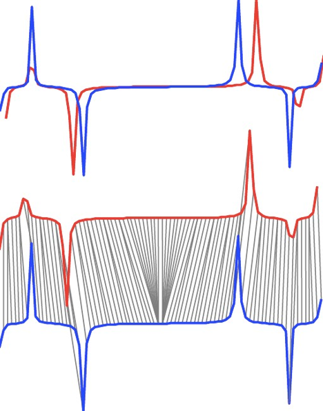
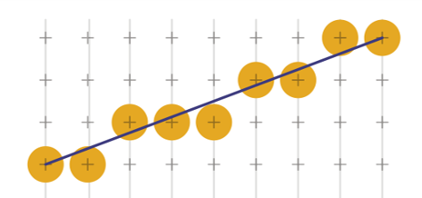
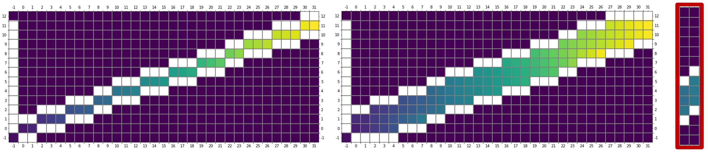

# DTW

(Algorithmically) Time and memory efficient implementation of Dynamic Time Warping distance measure for time series with the following improvements.

* Search pruning

  If the intermediary distance exceeds an optional threshold the computation is aborted and returns infinite distance. This is useful for k-nn searches.

* Sacoe-chiba bands

  Used to prune the search space of DTW within a window, resulting in faster computation and offering a parameter of maximum allowed distortion, with results in less spurious matchings

* Line-drawing band paddings

  The bands were implemented with padding and a line-drawing algorithm in order to avoid inelegant conditional checking of the bands and imprecision or bugs due the discretization of the band width.

* Dynamic programming space-saving trick.

  Since the computation only requires the immediate previous neighbors, the values are stored in a matrix with only 2 columns to store the current and previous computations.

Due to the highly conditional nature of the DTW algorithm, batch operations cannot be used. Lists were used instead of numpy arrays, which are slower in point operations.

The [notebook](dtw.ipynb) has the code, an example run and a benchmark.

More details of implementations decisions and performance in the [report](relatorio3-cezanne.pdf) (in Portuguese)
